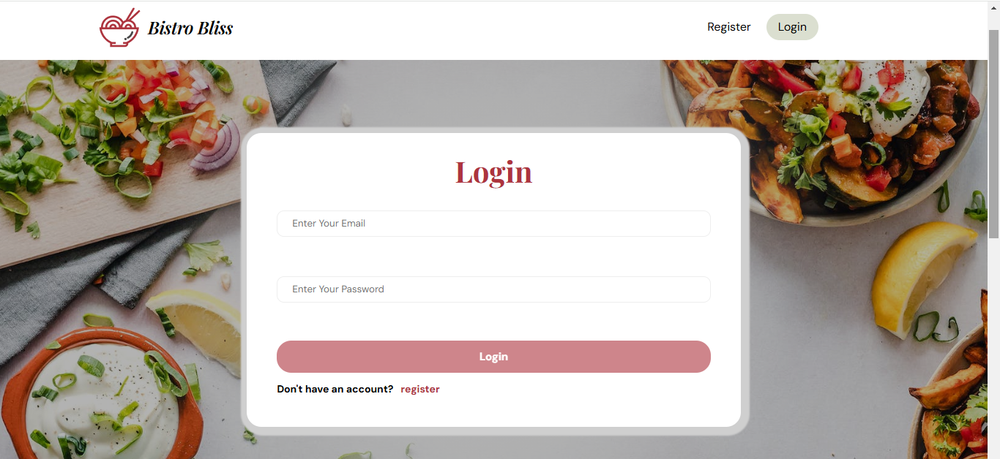
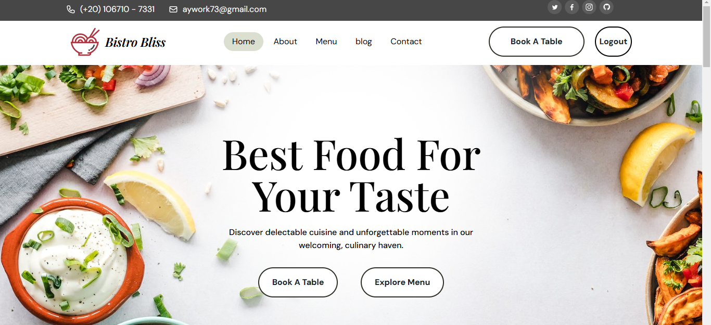

# Restaurant Management System (MEAN Stack)

This is a full-stack restaurant management system built using the **MEAN Stack** (MongoDB, Express.js, Angular, Node.js). It includes user authentication, product management, an admin panel, and a blog section.

## Features
- User authentication (Register/Login)
- Recipe/Product display (Fetching from Database)
- Admin panel with CRUD operations
- Blog section with recipe details

## Screenshots

### Login Page


### Home Page


## Installation and Setup

### Prerequisites
Ensure you have the following installed:
- [Node.js](https://nodejs.org/) (Latest LTS Version)
- [MongoDB](https://www.mongodb.com/try/download/community) (or use MongoDB Atlas)
- [Angular CLI](https://angular.io/cli)

### 1. Clone the Repository
```bash
git clone https://github.com/Ayman-Elfeky/Restaurant-Website.git
cd your-project-folder
```

### 2. Install Dependencies
Navigate to the frontend (Angular) and backend (API) folders and install the required dependencies.

#### Frontend:
```bash
npm install
```

#### Backend:
```bash
cd Api
npm install
```

### 3. Configure the Database
Ensure MongoDB is running on your system.

- **Local Database:** Start MongoDB on your machine:
  ```bash
  mongod --dbpath "C:\data\db"
  ```
  Then create the database in MongoDB shell:
  ```bash
  mongo
  use restaurantDB
  ```

- **Cloud Database (MongoDB Atlas):**  
  - Create an account at [MongoDB Atlas](https://www.mongodb.com/atlas).
  - Get your **MongoDB connection string** and update the `.env` file inside the `Api` folder:
    ```
    MONGO_URI=your_mongodb_connection_string
    ```

### 4. Run the Project

#### Start the Backend (Node.js + Express.js)
```bash
cd Api
node index.js
```
The server will start at `http://localhost:5000/`

#### Start the Frontend (Angular)
```bash
ng serve
```
The application will be available at `http://localhost:4200/`

### 5. Admin Access
There is only **one admin account** available in the database. You can check it inside the `Api` folder or manually create an admin user.

## Technologies Used
- **MongoDB** - NoSQL Database
- **Express.js** - Backend Framework
- **Angular** - Frontend Framework
- **Node.js** - JavaScript Runtime
- **JWT** - Authentication
- **Mongoose** - ODM for MongoDB
- **Bootstrap** - UI Styling

## Contributing
Feel free to submit issues or pull requests.
